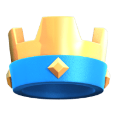
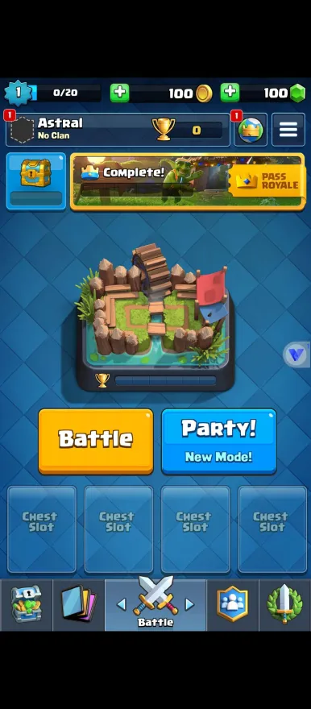

<div align="left">
  <table>
    <tr>
      <td>
        
      </td>
      <td>
        <h1 style="margin: 0; font-size: 32px;">Apexpowa Royale Server (ARS) - <a href="https://www.gnu.org/licenses/gpl-3.0"></a></h1>
        <strong>The best 2026 Clash Royale private server emulator made for you!</strong><br>
        > A next-generation Clash Royale private server emulator written in JavaScript.</p>
      </td>
    </tr>
  </table>
</div>

---

## ARS - Project
ARS is a lightweight Clash of Clans game server. It has been written by **Astral & cartyrty** from **Greedycell & Apexpowa**.
The goal of this emulator is to ensure a clean, easy-to-understand code environment. ARS uses async operators and MongoDB servers will be used to save players/clans.

---

## Features
- No information available.

---

## Requirements

Make sure you have the following installed:

- [Node.js](https://nodejs.org)
- [MongoDB Community Server](https://www.mongodb.com/try/download/community)

---

## Installation

### 1. Clone the repository
```bash
git clone https://github.com/Apexpowa/ARS.git
cd ARS
```

### 2. Install dependencies
```bash
npm install
```

### 3. Start the server
```bash
node .
```

---

## Connecting

After starting the server, use the **Apexpowa client** available in the **Releases** section to play the game.

---

## Screenshots



---

## Credits

- Core based on [nodebrawl-core](https://github.com/tailsjs/nodebrawl-core) by **tailsjs**

---

## Disclaimer

**Apexpowa**'s resources and programs are protected under the GPL-3.0 license. **Apexpowa**'s resources and programs are created by the (**Apexpowa**) team.
**Apexpowa** is **NOT** affiliated with 'Supercell, Oy'.
**Apexpowa** does **NOT** own 'Clash of Clans', 'Boom Beach', 'Clash Royale', and/or 'Hay Day'.


